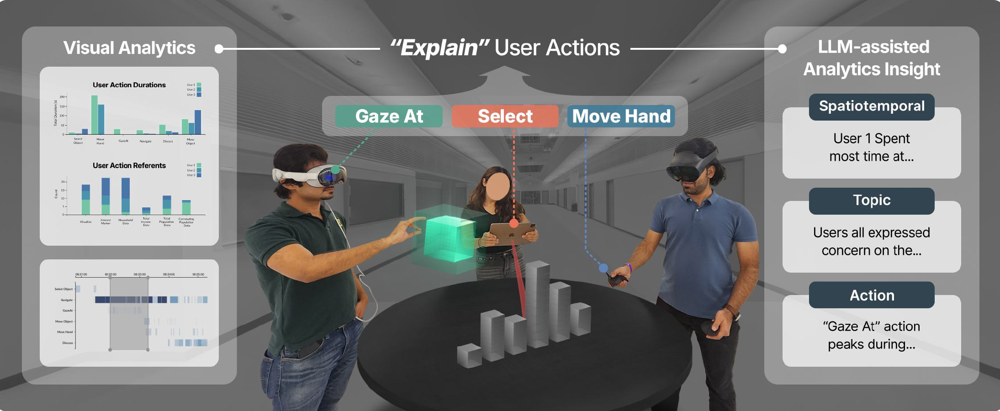

# **Explainable XR: Understanding User Behaviors of XR Environments using LLM-assisted Analytics Framework**

> *Yoonsang Kim, Zainab Aamir, Mithilesh Singh, Saeed Boorboor, Klaus Mueller, Arie E. Kaufman.*<br>
> *IEEE Transactions on Visualization and Computer Graphics (IEEE VR), 2025*<br>
> [ [Paper (Pre-print)](https://arxiv.org/pdf/2501.13778) [Demo video](https://youtu.be/kCRTP19A6TM) ]

_Explainable XR (EXR)_ is an end-to-end framework that captures, analyzes, and visualizes the multimodal behaviors of users in XR environments -- VR, AR, MR. 
This repository contains the **(1)** Unity-based capturing module that follows the UAD (User Action Descriptor) format along with example XR apps, **(2)** data processing module written in Python, and our **(3)** web-based analytics interface. **Please adapt the provided UAD structure and data types to match your purpose.**

<p align="center">
    
</p>


## **Installation**
(Coming soon)

## **Demo Application**
(Coming soon)


## **Abstract**
We present _Explainable XR_, an end-to-end framework for analyzing user behavior in diverse eXtended Reality (XR) environments by leveraging Large Language Models (LLMs) for data interpretation assistance. Existing XR user analytics frameworks face challenges in handling cross-virtuality – AR, VR, MR – transitions, multi-user collaborative application scenarios, and the complexity of multimodal data. Explainable XR addresses these challenges by providing a virtuality-agnostic solution for the collection, analysis, and visualization of immersive sessions. We propose three main components in our framework: (1) A novel user data recording schema, called User Action Descriptor (UAD), that can capture the users’ multimodal actions, along with their intents and the contexts; (2) a platform-agnostic XR session recorder, and (3) a visual analytics interface that offers LLM-assisted insights tailored to the analysts’ perspectives, facilitating the exploration and analysis of the recorded XR session data. We demonstrate the versatility of Explainable XR by demonstrating five use-case scenarios, in both individual and collaborative XR applications across virtualities. Our technical evaluation and user studies show that Explainable XR provides a highly usable analytics solution for understanding user actions and delivering multifaceted, actionable insights into user behaviors in immersive environments.

## **Citation**
```
@article {kim2025explainablexr,
    title={Explainable XR: Understanding User Behaviors of XR Environments using LLM-assisted Analytics Framework},
    author={Yoonsang Kim, Zainab Aamir, Mithilesh Singh, Saeed Boorboor, Klaus Mueller, and Arie E. Kaufman},
    year={2025},
    journal={arXiv preprint arXiv:2501.13778}
}
```